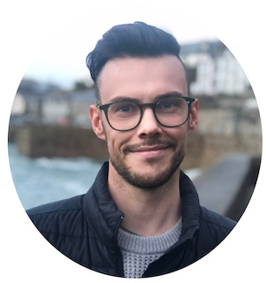

I am a PhD candidate working with [Dr. Emma Robinson](https://scholar.google.co.uk/citations?user=WXAAOb0AAAAJ&hl=en") and [Professor David Edwards](https://scholar.google.co.uk/citations?user=jPBN0G8AAAAJ&hl=en) within the [METRICS lab](https://metrics-lab.github.io/) and the [Centre for the Developing Brain](https://www.developingbrain.co.uk/about-the-centre-for-the-developing-brain/) at King's College London. The aim of my current research is to understand genetic influences in the developing brain using magnetic resonance imaging, the ultimate goal of which is to improve the outcomes of babies who are at risk of poor neurodevelopmental outcomes. 

Before moving to the UK, I completed a BSc (biomedical science), BMedSc(Hons) (first-class) in neonatal medicine, and an MBChB (Bachelor of Medicine and Bachelor of Surgery) at [The University of Auckland](https://www.auckland.ac.nz/en/fmhs.html), New Zealand. See my [curriculum vitae](https://lzjwilliams.github.io/assets/cv/Curriculum_Vitae.pdf) for more detail. 
